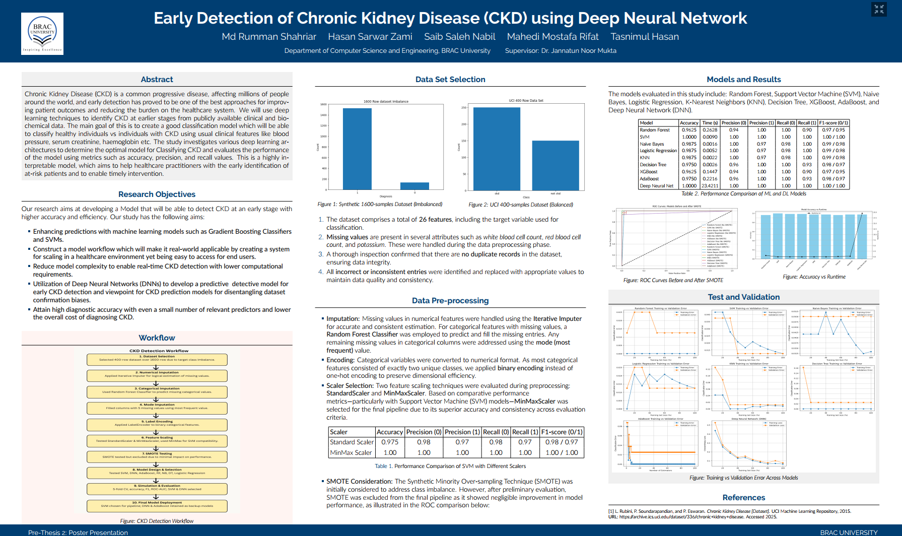

## 📊 Poster




An IoT-Compatible Pipeline Comparing Existing State-of-the-Art Machine Learning and Neural Network Approaches for Early-Stage Chronic Kidney Disease Detection


# An IoT-Compatible Pipeline Comparing Existing State-of-the-Art Approaches for Early-Stage Chronic Kidney Disease Detection

This repository presents an IoT-compatible machine learning and deep learning pipeline for the early-stage detection of **Chronic Kidney Disease (CKD)**. The project performs a comparative analysis of existing state-of-the-art classical machine learning models and neural network approaches, emphasizing deployability, explainability, and performance in resource-constrained IoT environments.

The work integrates preprocessing, statistical analysis, model training, evaluation, and explainable AI (XAI) to support reliable and interpretable CKD risk prediction.

---

## Overview

Early detection of Chronic Kidney Disease is critical for preventing progression to end-stage renal failure. This project proposes a complete data-driven pipeline suitable for IoT-based healthcare systems, where patient data can be collected from sensors and clinical sources and processed efficiently using machine learning and neural network models.

The pipeline focuses on balancing **accuracy, computational efficiency, interpretability, and deployment feasibility** for real-world healthcare applications.

---

## Project Structure

The repository contains the following components:

- `data SETS/`  
  Contains the datasets used for CKD analysis and experimentation.

- `risk factor dnn/`  
  Deep neural network models focusing on CKD risk factor prediction.

- `Images_report/`  
  Figures, plots, and visual resources generated for reporting and analysis.

- `Data_Set_Merge_Code.ipynb`  
  Code for merging and organizing multiple datasets into a unified format.

- `Preprocessing and Test pipeline.ipynb`  
  Data cleaning, preprocessing, feature engineering, and testing pipeline.

- `Results.ipynb`  
  Model training, testing, and performance evaluation.

- `Statistical_Analysis.ipynb`  
  Statistical analysis of features and experimental results.

- `Explainable_AI_(XAI)_.ipynb`  
  Explainability methods for interpreting model predictions.

- `Poster.png`  
  Project poster summarizing methodology and results.

- `README.md`  
  Project documentation.

---

## Objectives

- Develop an IoT-compatible CKD detection pipeline.  
- Compare classical machine learning and neural network approaches.  
- Evaluate models for early-stage CKD prediction.  
- Incorporate explainable AI for transparent decision-making.  
- Analyze performance, efficiency, and deployment feasibility.  
- Provide reproducible experimentation for healthcare research.

---

## Models and Approaches

### Classical Machine Learning Models

- Logistic Regression.  
- Support Vector Machine (SVM).  
- Random Forest.  
- K-Nearest Neighbors.  
- Naive Bayes.

### Neural Network Models

- Deep Neural Networks (DNN).  
- Risk factor-based neural architectures.  
- Other custom neural models implemented in notebooks.

---

## Methodology

1. Dataset collection and merging.  
2. Data preprocessing and normalization.  
3. Exploratory and statistical analysis.  
4. Feature engineering and selection.  
5. Model training using classical ML and neural networks.  
6. Hyperparameter tuning.  
7. Evaluation using medical classification metrics.  
8. Explainable AI analysis for interpretability.  
9. Comparative performance analysis for IoT deployment.

---

## Evaluation Metrics

Models are evaluated using:

- Accuracy.  
- Precision.  
- Recall.  
- F1-score.  
- ROC-AUC.  
- Confusion Matrix.

These metrics provide insight into both overall and class-wise performance for CKD detection.

---

## Explainable AI (XAI)

To ensure transparency in healthcare decision systems, the project integrates explainable AI techniques to interpret model predictions, analyze feature importance, and support clinician trust in automated CKD risk assessment.

The XAI workflow is implemented in:

- `Explainable_AI_(XAI)_.ipynb`

---

## How to Run

1. Clone the repository:

```bash
git clone https://github.com/RummanShahriar/An-IoT-Compatible-Pipeline-Comparing-Existing-State-of-the-Art-Approaches.git
cd An-IoT-Compatible-Pipeline-Comparing-Existing-State-of-the-Art-Approaches
````

2. Install dependencies:

```bash
pip install numpy pandas scikit-learn matplotlib seaborn tensorflow torch shap
```

3. Execute notebooks in sequence:

* `Data_Set_Merge_Code.ipynb`
* `Preprocessing and Test pipeline.ipynb`
* `Statistical_Analysis.ipynb`
* `Results.ipynb`
* `Explainable_AI_(XAI)_.ipynb`

---

## Results

The experiments demonstrate that both classical machine learning and neural network approaches can effectively detect early-stage CKD. Neural models provide higher predictive power, while classical models offer better interpretability and computational efficiency for IoT environments.

Detailed plots, tables, and comparisons are available in the `Results.ipynb` and `Images_report` directory.

---

## Tools and Technologies

* Language: Python 3.x.
* Libraries: NumPy, Pandas, scikit-learn, TensorFlow, PyTorch, SHAP.
* Visualization: Matplotlib, Seaborn.
* Environment: Jupyter Notebook.

---


## Applications

* IoT-based healthcare monitoring systems.
* Early CKD screening tools.
* Clinical decision support systems.
* Medical data analytics platforms.
* Research benchmarking for disease prediction models.

```

